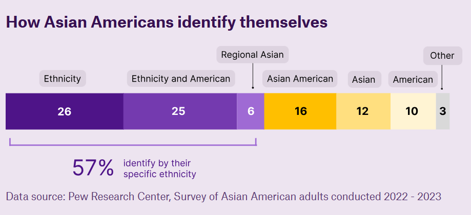

# How accurately are asian americans cast in Hollywood?
## La historia que cuenta
##### En esta webstory se cuenta la historia de Haimei, quien se alegra de ver personajes asiáticos que no sólo representan estereotipos en los programas de televisión de su interés. Sin embargo, esta evolución no es del todo positiva y acertada, ya que no se trata sólo de tener un personaje asiático, sino que este sea representado según el país del que proviene el actor. Cada país tiene su propia identidad y en Hollywood a veces érroneamente creen que todos los asiaticos son iguales. 
##### Un estudio publicado en 2025 mostró que menos del 30% de los asiáticos y los habitantes de las islas del Pacífico sienten que están representados en los medios de comunicación. 

##### Sin embargo, la hipotésis fue rechazada, porque los autores creyeron que iban a econtrar más casos de personajes mal elegidos y malos repartos que lo contrario. El análisis reveló que la mayoría de las películas con un reparto adecuado, que fue para los creadores de la webstory, algo muy inesperado. 
## Estructura narrativa
##### Me pareció interesante que *"The Pudding"* haya publicado esta webstory porque siento que es un fenómeno que se ha dado sobre todo el siglo XXI, de querer representar a todos en las grandes pantallas, pero con tal que aparezcan, no se preocupan si es un personaje adecuado, sólo que la producción se vea inclusiva. 
##### Por tanto, en la base de datos publicada, se analiza cómo se ven realmente representados los personajes asiáticos. 
##### De la estructura narrativa destacaría: 
1. Hay un orden cronológico, que te va mostrando los hitos por fecha, lo que le da al lector una claridad de la evolución de la representación.
2. Al poner un ejemplo puntual, se refuerza el enfoque de la historia, sin desviarse de ello. Además, crea más emoción y conexión con el lector al ser un tema comprensible por todos, los mismos espectadores perciben esas representaciones deficientes o inadecuadas. 
3. Va haciendo sub preguntas de hipótesis que también van guiando la lectura.
4. Tiene un inicio, desarrollo y conclusión claro. Lo que más destaco de ellos es la conclusión, en la que incluyen comentarios de los creadores de la webstory e incluso citas de una actriz estadounidense con ascendencia china. 
## Efectividad para transmitir la información
##### Al estar dividida en colores la informacion, visualmente se hace más fácil entender a las conclusiones que llegaron. Hay tres colores para indicar si las peliculas son completamente adecuadas, parcialemnte adecuadas o completamente inadecuadas. 
##### Además, al pasar el cursor por cada año de cada película, te da el detalle de la información, de forma ordenada y con una pequeña reseña sobre la evolución del reconocimento en pantalla, o incluso dirigiendo, de personas asiáticas. 
##### Hay secciones destacadas dentro de la información, en donde se dice literalmente lo que los autores notan o se dan cuenta de su información y la dicen con palabras simple y ejemplos de películas que representan el ejemplo que dan. 